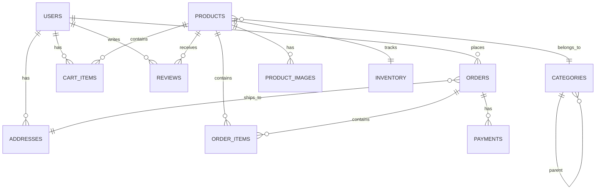

# Database Schema Design

## Overview

PostgreSQL database schema for E-Commerce Shopping Cart System with focus on normalization, performance, and scalability.

## Entity Relationship Diagram



## Core Tables

### users
User accounts and authentication data.

```sql
CREATE TABLE users (
    id SERIAL PRIMARY KEY,
    email VARCHAR(255) UNIQUE NOT NULL,
    password_hash VARCHAR(255) NOT NULL,
    first_name VARCHAR(100) NOT NULL,
    last_name VARCHAR(100) NOT NULL,
    phone VARCHAR(20),
    role VARCHAR(20) DEFAULT 'customer' CHECK (role IN ('customer', 'admin', 'moderator')),
    is_active BOOLEAN DEFAULT true,
    email_verified BOOLEAN DEFAULT false,
    email_verification_token VARCHAR(255),
    password_reset_token VARCHAR(255),
    password_reset_expires TIMESTAMP,
    last_login TIMESTAMP,
    created_at TIMESTAMP DEFAULT CURRENT_TIMESTAMP,
    updated_at TIMESTAMP DEFAULT CURRENT_TIMESTAMP,
    deleted_at TIMESTAMP
);

CREATE INDEX idx_users_email ON users(email);
CREATE INDEX idx_users_role ON users(role) WHERE is_active = true;
CREATE INDEX idx_users_created ON users(created_at DESC);
```

### addresses
User shipping and billing addresses.

```sql
CREATE TABLE addresses (
    id SERIAL PRIMARY KEY,
    user_id INTEGER NOT NULL REFERENCES users(id) ON DELETE CASCADE,
    address_type VARCHAR(20) DEFAULT 'shipping' CHECK (address_type IN ('shipping', 'billing', 'both')),
    is_default BOOLEAN DEFAULT false,
    recipient_name VARCHAR(200) NOT NULL,
    phone VARCHAR(20) NOT NULL,
    street_address_1 VARCHAR(255) NOT NULL,
    street_address_2 VARCHAR(255),
    city VARCHAR(100) NOT NULL,
    state VARCHAR(100),
    postal_code VARCHAR(20) NOT NULL,
    country VARCHAR(2) NOT NULL DEFAULT 'US',
    created_at TIMESTAMP DEFAULT CURRENT_TIMESTAMP,
    updated_at TIMESTAMP DEFAULT CURRENT_TIMESTAMP
);

CREATE INDEX idx_addresses_user ON addresses(user_id);
CREATE INDEX idx_addresses_default ON addresses(user_id, is_default) WHERE is_default = true;
```

### categories
Product categorization hierarchy.

```sql
CREATE TABLE categories (
    id SERIAL PRIMARY KEY,
    parent_id INTEGER REFERENCES categories(id) ON DELETE SET NULL,
    name VARCHAR(100) NOT NULL,
    slug VARCHAR(100) UNIQUE NOT NULL,
    description TEXT,
    image_url VARCHAR(500),
    display_order INTEGER DEFAULT 0,
    is_active BOOLEAN DEFAULT true,
    created_at TIMESTAMP DEFAULT CURRENT_TIMESTAMP,
    updated_at TIMESTAMP DEFAULT CURRENT_TIMESTAMP
);

CREATE INDEX idx_categories_parent ON categories(parent_id) WHERE is_active = true;
CREATE INDEX idx_categories_slug ON categories(slug);
CREATE INDEX idx_categories_order ON categories(display_order, is_active);
```

### products
Product catalog information.

```sql
CREATE TABLE products (
    id SERIAL PRIMARY KEY,
    category_id INTEGER REFERENCES categories(id) ON DELETE SET NULL,
    sku VARCHAR(100) UNIQUE NOT NULL,
    name VARCHAR(255) NOT NULL,
    slug VARCHAR(255) UNIQUE NOT NULL,
    description TEXT,
    short_description TEXT,
    price DECIMAL(10, 2) NOT NULL CHECK (price >= 0),
    compare_at_price DECIMAL(10, 2) CHECK (compare_at_price >= 0),
    cost DECIMAL(10, 2) CHECK (cost >= 0),
    weight DECIMAL(10, 2),
    dimensions_length DECIMAL(10, 2),
    dimensions_width DECIMAL(10, 2),
    dimensions_height DECIMAL(10, 2),
    is_active BOOLEAN DEFAULT true,
    is_featured BOOLEAN DEFAULT false,
    requires_shipping BOOLEAN DEFAULT true,
    taxable BOOLEAN DEFAULT true,
    meta_title VARCHAR(255),
    meta_description TEXT,
    meta_keywords TEXT,
    view_count INTEGER DEFAULT 0,
    created_at TIMESTAMP DEFAULT CURRENT_TIMESTAMP,
    updated_at TIMESTAMP DEFAULT CURRENT_TIMESTAMP,
    deleted_at TIMESTAMP
);

CREATE INDEX idx_products_category ON products(category_id) WHERE is_active = true AND deleted_at IS NULL;
CREATE INDEX idx_products_sku ON products(sku);
CREATE INDEX idx_products_slug ON products(slug);
CREATE INDEX idx_products_price ON products(price) WHERE is_active = true AND deleted_at IS NULL;
CREATE INDEX idx_products_featured ON products(is_featured) WHERE is_active = true AND deleted_at IS NULL;
CREATE INDEX idx_products_created ON products(created_at DESC);
CREATE INDEX idx_products_search ON products USING gin(to_tsvector('english', name || ' ' || COALESCE(description, '')));
```

### product_images
Product image gallery.

```sql
CREATE TABLE product_images (
    id SERIAL PRIMARY KEY,
    product_id INTEGER NOT NULL REFERENCES products(id) ON DELETE CASCADE,
    image_url VARCHAR(500) NOT NULL,
    alt_text VARCHAR(255),
    display_order INTEGER DEFAULT 0,
    is_primary BOOLEAN DEFAULT false,
    created_at TIMESTAMP DEFAULT CURRENT_TIMESTAMP
);

CREATE INDEX idx_product_images_product ON product_images(product_id, display_order);
CREATE INDEX idx_product_images_primary ON product_images(product_id) WHERE is_primary = true;
```

### inventory
Product inventory tracking.

```sql
CREATE TABLE inventory (
    id SERIAL PRIMARY KEY,
    product_id INTEGER UNIQUE NOT NULL REFERENCES products(id) ON DELETE CASCADE,
    quantity INTEGER NOT NULL DEFAULT 0 CHECK (quantity >= 0),
    reserved_quantity INTEGER NOT NULL DEFAULT 0 CHECK (reserved_quantity >= 0),
    available_quantity INTEGER GENERATED ALWAYS AS (quantity - reserved_quantity) STORED,
    low_stock_threshold INTEGER DEFAULT 10,
    track_inventory BOOLEAN DEFAULT true,
    allow_backorder BOOLEAN DEFAULT false,
    last_restocked_at TIMESTAMP,
    updated_at TIMESTAMP DEFAULT CURRENT_TIMESTAMP
);

CREATE INDEX idx_inventory_product ON inventory(product_id);
CREATE INDEX idx_inventory_low_stock ON inventory(product_id) WHERE available_quantity <= low_stock_threshold;
```

### cart_items
Shopping cart contents.

```sql
CREATE TABLE cart_items (
    id SERIAL PRIMARY KEY,
    user_id INTEGER NOT NULL REFERENCES users(id) ON DELETE CASCADE,
    product_id INTEGER NOT NULL REFERENCES products(id) ON DELETE CASCADE,
    quantity INTEGER NOT NULL CHECK (quantity > 0),
    price DECIMAL(10, 2) NOT NULL,
    created_at TIMESTAMP DEFAULT CURRENT_TIMESTAMP,
    updated_at TIMESTAMP DEFAULT CURRENT_TIMESTAMP,
    UNIQUE(user_id, product_id)
);

CREATE INDEX idx_cart_items_user ON cart_items(user_id);
CREATE INDEX idx_cart_items_product ON cart_items(product_id);
```

### orders
Customer orders.

```sql
CREATE TABLE orders (
    id SERIAL PRIMARY KEY,
    user_id INTEGER NOT NULL REFERENCES users(id) ON DELETE RESTRICT,
    order_number VARCHAR(50) UNIQUE NOT NULL,
    status VARCHAR(20) NOT NULL DEFAULT 'pending' CHECK (status IN ('pending', 'processing', 'shipped', 'delivered', 'cancelled', 'refunded')),
    
    -- Pricing
    subtotal DECIMAL(10, 2) NOT NULL CHECK (subtotal >= 0),
    tax_amount DECIMAL(10, 2) NOT NULL DEFAULT 0 CHECK (tax_amount >= 0),
    shipping_amount DECIMAL(10, 2) NOT NULL DEFAULT 0 CHECK (shipping_amount >= 0),
    discount_amount DECIMAL(10, 2) NOT NULL DEFAULT 0 CHECK (discount_amount >= 0),
    total_amount DECIMAL(10, 2) NOT NULL CHECK (total_amount >= 0),
    
    -- Currency
    currency VARCHAR(3) NOT NULL DEFAULT 'USD',
    exchange_rate DECIMAL(10, 4) DEFAULT 1.0000,
    
    -- Shipping
    shipping_address_id INTEGER REFERENCES addresses(id) ON DELETE SET NULL,
    billing_address_id INTEGER REFERENCES addresses(id) ON DELETE SET NULL,
    shipping_method VARCHAR(50),
    tracking_number VARCHAR(100),
    shipped_at TIMESTAMP,
    delivered_at TIMESTAMP,
    
    -- Customer notes
    customer_note TEXT,
    admin_note TEXT,
    
    -- IP and metadata
    customer_ip VARCHAR(45),
    user_agent TEXT,
    
    -- Timestamps
    created_at TIMESTAMP DEFAULT CURRENT_TIMESTAMP,
    updated_at TIMESTAMP DEFAULT CURRENT_TIMESTAMP,
    cancelled_at TIMESTAMP
);

CREATE INDEX idx_orders_user ON orders(user_id);
CREATE INDEX idx_orders_number ON orders(order_number);
CREATE INDEX idx_orders_status ON orders(status, created_at DESC);
CREATE INDEX idx_orders_created ON orders(created_at DESC);
CREATE INDEX idx_orders_tracking ON orders(tracking_number) WHERE tracking_number IS NOT NULL;
```

### order_items
Individual items within orders.

```sql
CREATE TABLE order_items (
    id SERIAL PRIMARY KEY,
    order_id INTEGER NOT NULL REFERENCES orders(id) ON DELETE CASCADE,
    product_id INTEGER NOT NULL REFERENCES products(id) ON DELETE RESTRICT,
    
    -- Snapshot of product data at order time
    product_name VARCHAR(255) NOT NULL,
    product_sku VARCHAR(100) NOT NULL,
    product_image_url VARCHAR(500),
    
    -- Pricing
    quantity INTEGER NOT NULL CHECK (quantity > 0),
    unit_price DECIMAL(10, 2) NOT NULL CHECK (unit_price >= 0),
    subtotal DECIMAL(10, 2) NOT NULL CHECK (subtotal >= 0),
    tax_amount DECIMAL(10, 2) NOT NULL DEFAULT 0,
    total_amount DECIMAL(10, 2) NOT NULL CHECK (total_amount >= 0),
    
    created_at TIMESTAMP DEFAULT CURRENT_TIMESTAMP
);

CREATE INDEX idx_order_items_order ON order_items(order_id);
CREATE INDEX idx_order_items_product ON order_items(product_id);
```

### payments
Payment transactions.

```sql
CREATE TABLE payments (
    id SERIAL PRIMARY KEY,
    order_id INTEGER NOT NULL REFERENCES orders(id) ON DELETE CASCADE,
    payment_method VARCHAR(50) NOT NULL CHECK (payment_method IN ('stripe', 'paypal', 'credit_card', 'bank_transfer')),
    payment_status VARCHAR(20) NOT NULL DEFAULT 'pending' CHECK (payment_status IN ('pending', 'processing', 'succeeded', 'failed', 'refunded', 'cancelled')),
    
    -- Amounts
    amount DECIMAL(10, 2) NOT NULL CHECK (amount >= 0),
    currency VARCHAR(3) NOT NULL DEFAULT 'USD',
    
    -- External references
    transaction_id VARCHAR(255) UNIQUE,
    stripe_payment_intent_id VARCHAR(255),
    stripe_charge_id VARCHAR(255),
    
    -- Metadata
    payment_metadata JSONB,
    failure_reason TEXT,
    
    -- Timestamps
    processed_at TIMESTAMP,
    created_at TIMESTAMP DEFAULT CURRENT_TIMESTAMP,
    updated_at TIMESTAMP DEFAULT CURRENT_TIMESTAMP
);

CREATE INDEX idx_payments_order ON payments(order_id);
CREATE INDEX idx_payments_transaction ON payments(transaction_id);
CREATE INDEX idx_payments_stripe_intent ON payments(stripe_payment_intent_id) WHERE stripe_payment_intent_id IS NOT NULL;
CREATE INDEX idx_payments_status ON payments(payment_status, created_at DESC);
```

### reviews
Product reviews and ratings.

```sql
CREATE TABLE reviews (
    id SERIAL PRIMARY KEY,
    product_id INTEGER NOT NULL REFERENCES products(id) ON DELETE CASCADE,
    user_id INTEGER NOT NULL REFERENCES users(id) ON DELETE CASCADE,
    order_id INTEGER REFERENCES orders(id) ON DELETE SET NULL,
    
    rating INTEGER NOT NULL CHECK (rating >= 1 AND rating <= 5),
    title VARCHAR(255),
    comment TEXT,
    
    is_verified_purchase BOOLEAN DEFAULT false,
    is_approved BOOLEAN DEFAULT false,
    helpful_count INTEGER DEFAULT 0,
    
    created_at TIMESTAMP DEFAULT CURRENT_TIMESTAMP,
    updated_at TIMESTAMP DEFAULT CURRENT_TIMESTAMP,
    
    UNIQUE(product_id, user_id)
);

CREATE INDEX idx_reviews_product ON reviews(product_id) WHERE is_approved = true;
CREATE INDEX idx_reviews_user ON reviews(user_id);
CREATE INDEX idx_reviews_rating ON reviews(product_id, rating DESC) WHERE is_approved = true;
CREATE INDEX idx_reviews_helpful ON reviews(helpful_count DESC) WHERE is_approved = true;
```

## Support Tables

### sessions
User session management (if not using JWT-only).

```sql
CREATE TABLE sessions (
    sid VARCHAR(255) PRIMARY KEY,
    sess JSONB NOT NULL,
    expire TIMESTAMP NOT NULL
);

CREATE INDEX idx_sessions_expire ON sessions(expire);
```

### audit_logs
System audit trail.

```sql
CREATE TABLE audit_logs (
    id SERIAL PRIMARY KEY,
    user_id INTEGER REFERENCES users(id) ON DELETE SET NULL,
    action VARCHAR(100) NOT NULL,
    entity_type VARCHAR(100) NOT NULL,
    entity_id INTEGER,
    old_values JSONB,
    new_values JSONB,
    ip_address VARCHAR(45),
    user_agent TEXT,
    created_at TIMESTAMP DEFAULT CURRENT_TIMESTAMP
);

CREATE INDEX idx_audit_logs_user ON audit_logs(user_id, created_at DESC);
CREATE INDEX idx_audit_logs_entity ON audit_logs(entity_type, entity_id, created_at DESC);
CREATE INDEX idx_audit_logs_created ON audit_logs(created_at DESC);
```

### email_queue
Email notification queue.

```sql
CREATE TABLE email_queue (
    id SERIAL PRIMARY KEY,
    user_id INTEGER REFERENCES users(id) ON DELETE SET NULL,
    recipient_email VARCHAR(255) NOT NULL,
    subject VARCHAR(255) NOT NULL,
    template_name VARCHAR(100) NOT NULL,
    template_data JSONB,
    status VARCHAR(20) DEFAULT 'pending' CHECK (status IN ('pending', 'sent', 'failed')),
    sendgrid_message_id VARCHAR(255),
    error_message TEXT,
    attempts INTEGER DEFAULT 0,
    max_attempts INTEGER DEFAULT 3,
    scheduled_at TIMESTAMP DEFAULT CURRENT_TIMESTAMP,
    sent_at TIMESTAMP,
    created_at TIMESTAMP DEFAULT CURRENT_TIMESTAMP
);

CREATE INDEX idx_email_queue_status ON email_queue(status, scheduled_at) WHERE status = 'pending';
CREATE INDEX idx_email_queue_user ON email_queue(user_id);
```

## Views

### product_catalog_view
Optimized view for product listing.

```sql
CREATE VIEW product_catalog_view AS
SELECT 
    p.id,
    p.sku,
    p.name,
    p.slug,
    p.short_description,
    p.price,
    p.compare_at_price,
    p.is_featured,
    c.name as category_name,
    c.slug as category_slug,
    pi.image_url as primary_image,
    i.available_quantity,
    i.allow_backorder,
    COALESCE(AVG(r.rating), 0) as avg_rating,
    COUNT(DISTINCT r.id) as review_count
FROM products p
LEFT JOIN categories c ON p.category_id = c.id
LEFT JOIN product_images pi ON p.id = pi.product_id AND pi.is_primary = true
LEFT JOIN inventory i ON p.id = i.product_id
LEFT JOIN reviews r ON p.id = r.product_id AND r.is_approved = true
WHERE p.is_active = true AND p.deleted_at IS NULL
GROUP BY p.id, c.name, c.slug, pi.image_url, i.available_quantity, i.allow_backorder;
```

### order_summary_view
Order summary for admin dashboard.

```sql
CREATE VIEW order_summary_view AS
SELECT 
    o.id,
    o.order_number,
    o.status,
    u.email as customer_email,
    u.first_name || ' ' || u.last_name as customer_name,
    o.total_amount,
    o.currency,
    COUNT(oi.id) as item_count,
    o.created_at,
    o.shipped_at,
    o.delivered_at
FROM orders o
JOIN users u ON o.user_id = u.id
LEFT JOIN order_items oi ON o.id = oi.order_id
GROUP BY o.id, u.email, u.first_name, u.last_name;
```

## Functions & Triggers

### Update timestamp trigger

```sql
CREATE OR REPLACE FUNCTION update_updated_at_column()
RETURNS TRIGGER AS $$
BEGIN
    NEW.updated_at = CURRENT_TIMESTAMP;
    RETURN NEW;
END;
$$ language 'plpgsql';

-- Apply to all tables with updated_at
CREATE TRIGGER update_users_updated_at BEFORE UPDATE ON users
    FOR EACH ROW EXECUTE FUNCTION update_updated_at_column();

CREATE TRIGGER update_products_updated_at BEFORE UPDATE ON products
    FOR EACH ROW EXECUTE FUNCTION update_updated_at_column();
-- ... (apply to other tables)
```

### Inventory reservation on order creation

```sql
CREATE OR REPLACE FUNCTION reserve_inventory()
RETURNS TRIGGER AS $$
BEGIN
    UPDATE inventory
    SET reserved_quantity = reserved_quantity + NEW.quantity
    WHERE product_id = NEW.product_id;
    
    RETURN NEW;
END;
$$ LANGUAGE plpgsql;

CREATE TRIGGER reserve_inventory_trigger
AFTER INSERT ON order_items
FOR EACH ROW EXECUTE FUNCTION reserve_inventory();
```

### Generate order number

```sql
CREATE OR REPLACE FUNCTION generate_order_number()
RETURNS TRIGGER AS $$
BEGIN
    NEW.order_number = 'ORD-' || TO_CHAR(CURRENT_TIMESTAMP, 'YYYYMMDD') || '-' || LPAD(NEW.id::TEXT, 6, '0');
    RETURN NEW;
END;
$$ LANGUAGE plpgsql;

CREATE TRIGGER generate_order_number_trigger
BEFORE INSERT ON orders
FOR EACH ROW EXECUTE FUNCTION generate_order_number();
```

## Performance Optimization

### Partitioning Strategy (for high-volume tables)

```sql
-- Partition orders by month
CREATE TABLE orders_2026_01 PARTITION OF orders
    FOR VALUES FROM ('2026-01-01') TO ('2026-02-01');

CREATE TABLE orders_2026_02 PARTITION OF orders
    FOR VALUES FROM ('2026-02-01') TO ('2026-03-01');
-- ... continue for other months
```

### Materialized Views for Analytics

```sql
CREATE MATERIALIZED VIEW sales_analytics AS
SELECT 
    DATE_TRUNC('day', created_at) as sale_date,
    COUNT(*) as order_count,
    SUM(total_amount) as total_revenue,
    AVG(total_amount) as avg_order_value
FROM orders
WHERE status NOT IN ('cancelled', 'refunded')
GROUP BY DATE_TRUNC('day', created_at);

CREATE INDEX idx_sales_analytics_date ON sales_analytics(sale_date DESC);
```

## Data Integrity Rules

1. **Soft Deletes**: Users and Products use `deleted_at` timestamp
2. **Price Snapshots**: Order items store product data to preserve history
3. **Inventory Constraints**: Prevent negative inventory unless backorder allowed
4. **Referential Integrity**: Use appropriate ON DELETE actions
5. **Audit Trail**: Critical operations logged to `audit_logs`

## Migration Strategy

### Phase 1: Core Tables
- users, addresses, sessions

### Phase 2: Product Catalog
- categories, products, product_images, inventory

### Phase 3: Shopping & Orders
- cart_items, orders, order_items, payments

### Phase 4: Enhanced Features
- reviews, email_queue, audit_logs

### Phase 5: Optimization
- Indexes, views, functions, triggers

---

**Document Version:** 1.0  
**Last Updated:** October 24, 2025
